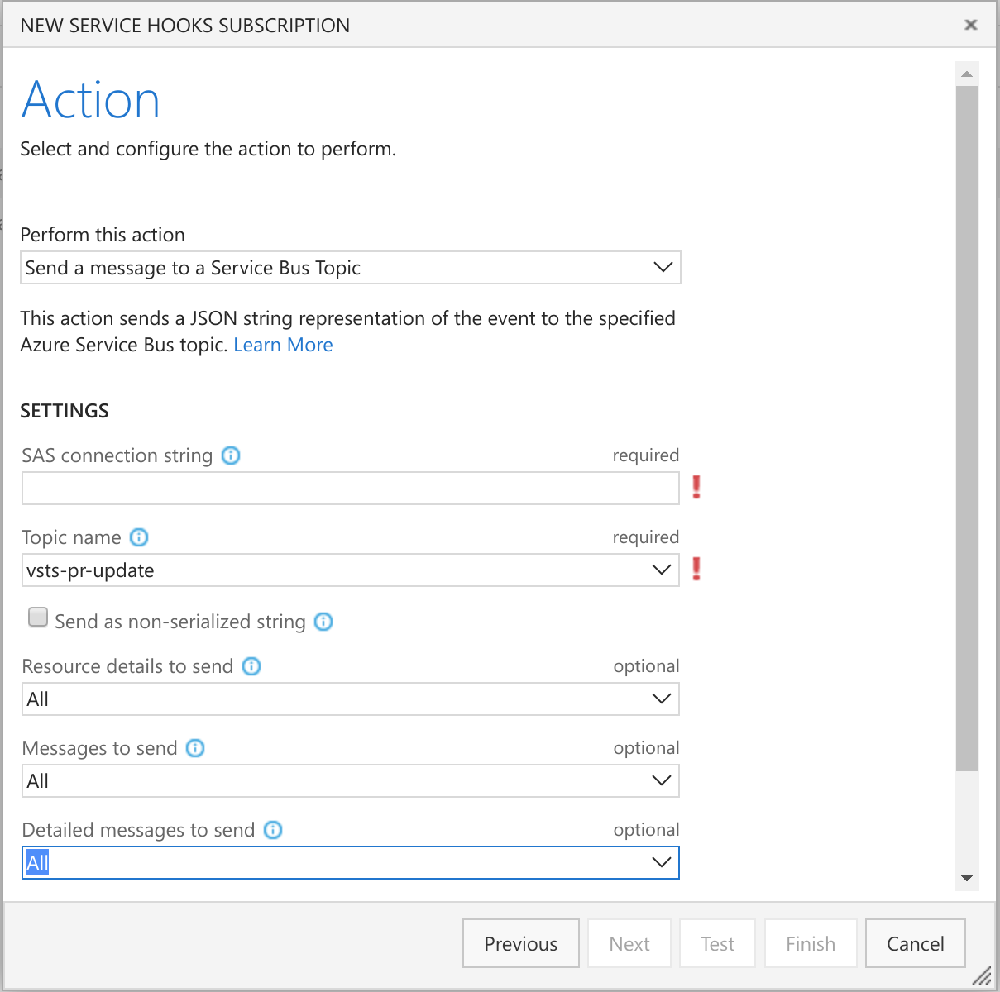

# Azure Pipelines PR Reviewer

An Azure Pipelines pull request review service, built on Azure Container Instance, Azure Logic App and Azure Service Bus.


## How it works

When a Azure Pipelines pull request is created or updated, Azure Pipelines sends a notification to an Azure Service Bus topic. As a subscriber of the topic, an Azure Logic App starts an Azure Container Instance upon getting the notification. The container in Azure Container Instance utilizes Azure Pipelines REST API to check the changes in the pull request, leave comments and vote approve/wait.


## How to deploy

### Deploy ARM template

<a href="https://portal.azure.com/#create/Microsoft.Template/uri/https%3A%2F%2Fraw.githubusercontent.com%2Fwenwu449%2Fvsts-pr-reviewer%2Fmaster%2Fazuredeploy.json" target="_blank">
    
</a>
<a href="http://armviz.io/#/?load=https%3A%2F%2Fraw.githubusercontent.com%2Fwenwu449%2Fvsts-pr-reviewer%2Fmaster%2Fazuredeploy.json" target="_blank">
    
</a>

The ARM template deployment deploys Logic App, Service Bus Namepsace and Topic, it also registers Logic App as a subscriber of the Service Bus Topic. Logic App is configured to start a Container Instance with docker image [wenwu/pr-review](https://hub.docker.com/r/wenwu449/pr-review/) when getting a message from the Service Bus topic.

### Authorize ACI connection in Logic App
To grant Logic App the permission to create Container Instance, we need to authorize ACI connection in Logic App.

After deployment, navigate to the resource group in Azure portal, open the logic app resource:


Open designer (click "Edit" button), click "Connections" in the flow:


Click "Invalid connection" to configure connection:


Sign in with user account or service pricipal.


Click "Save" button to save the changes.

### Configure Azure Pipelines

#### Configure Service Hook

[Service hooks](https://docs.microsoft.com/en-us/vsts/service-hooks/overview?view=vsts) enable you to perform tasks on other services when events happen in your Azure Pipelines projects. We will configure service hook so that message will be sent to Serivce Bus Topic when pull request is created.

1. Get service bus topic connection string with commands, `<resource-group-name>` is the name of resource group used for ARM template deployment:
```
groupName=<resource-group-name>
nsName=$(az servicebus namespace list -g $groupName | jq -r ".[0].name")
az servicebus topic authorization-rule keys list -g $groupName --namespace-name $nsName --topic-name vsts-pr-update -n vsts-hook | jq -r ".primaryConnectionString" | rev | cut -d ';' -f2- | rev
```
Copy the connection string. You will need to provide this value when creating a Service Hook subscription.

2. Go to Azure Pipelines project to configure service hook.

Click "Create subscription"


Select "Azure Service Bus" and click "Next".

Select "Pull Request created" trigger, configure "Repository", "Target branch" and other filters if applies, click "Next".


Select "Send a message to a Service Bus Topic" at "Perform this action", input the connection string got in step 1 at "SAS connection string", input "vsts-pr-update" at "Topic name", click "Test" to test, then click "Finsh".



Optionally, another subscription can be created to send message when a pull request is updated.

#### Get VSTS personal access token

The reviewer application running in Azure Container Instance uses a Azure Pipelines [personal access token](https://docs.microsoft.com/en-us/vsts/integrate/get-started/authentication/pats?view=vsts) to read, comment and vote on a pull request.

Log in Azure Pipelines, go to your security details.


Create a personal access token


Select the "Code (read and write)" scope for the token, click "Save"


When you're done, make sure to copy the token. You'll use this token in next step.

**Treat the token as secret, the token is your identity and acts as you when it is used.**

### Upload VSTS config

The reviewer application running in Azure Container Instance reads configuration file on an Azure Storage File Share to get the personal access token and other Azure Pipelines information. 

Download the [config.json](https://raw.githubusercontent.com/wenwu449/vsts-pr-review-sample/master/config.json) as a template, change the value according to your Azure Pipelines project.

*userId can be get via [Accounts](https://docs.microsoft.com/en-us/rest/api/vsts/account/accounts/list) API ( `accountId` in response ) or [Get Pull Request](https://docs.microsoft.com/en-us/rest/api/vsts/git/pull%20requests/get%20pull%20request) API ( `createdBy.Id` in response )*

Use Azure Portal to upload the `config.json` file to Azure Storage File Share, navigate to the resource group in Azure portal, open the storage resource (resource name may vary):


Click "Files",


Click "vsts-pr-preview", then click "config",


Click "Upload", use the file upload control to upload the `config.json` file.


Now your pull request review service is up and running!
